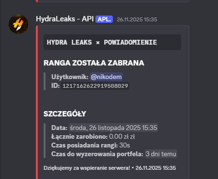
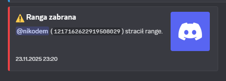
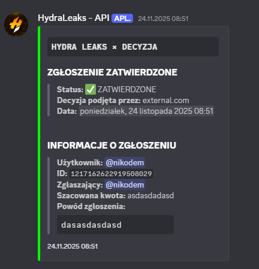
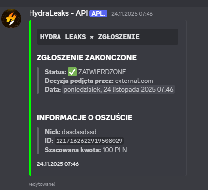
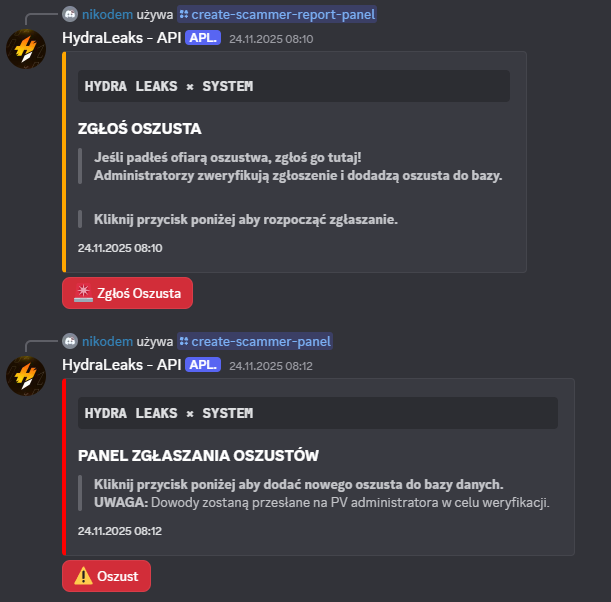
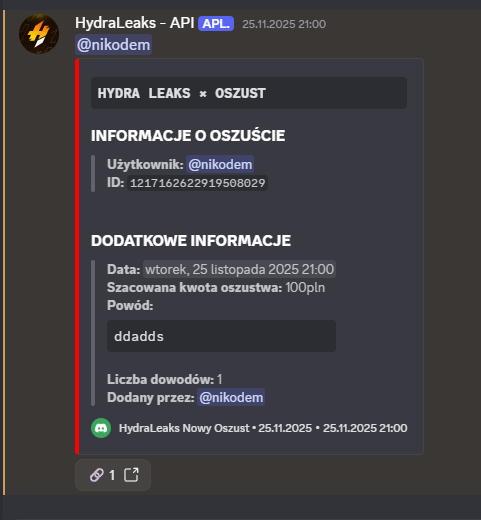

# Portfolio
Developer Java i JavaScript. Tworzę boty Discord oraz pluginy do Minecrafta, stawiając na prostotę, wydajność i czysty, łatwy w utrzymaniu kod.

# external

Developer Java & JavaScript  
Tworzę boty Discord oraz pluginy do Minecrafta. Stawiam na prostotę, wydajność i czysty kod.

---

## ⚙️ Technologie

### 🟧 Java
- Pluginy Minecraft (Spigot / Paper)  
- Logika gry, mechaniki, administracja

### 🟨 JavaScript
- Boty Discord (discord.js)  
- Systemy komend, automatyzacje, integracje API

### 📦 Inne
- Node.js  
- Maven  

---

## 🚀 Projekty
- Bot Discord dla HydraLeaks (7k użytkowników) – komendy, moderacja, automatyzacje  
- Pluginy Minecraft – serwer 2k [discord], mechaniki i narzędzia administracyjne  
- Własne projekty – boty, pluginy i eksperymentalne narzędzia w Java i JS

---

## 📫 Kontakt
- Discord: *external.com*  

---

## 📝 Krótki opis repozytorium
**Developer Java i JavaScript. Tworzę boty Discord oraz pluginy do Minecrafta, stawiając na prostotę, wydajność i czysty, łatwy w utrzymaniu kod.**

 #1

 #2

 #3

 #4

 #5

 #6

 #7

 #8

 #9

