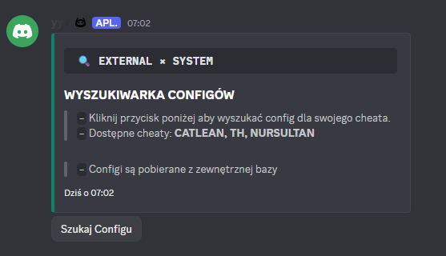
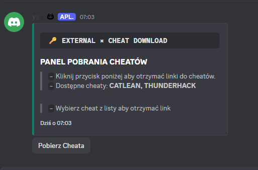
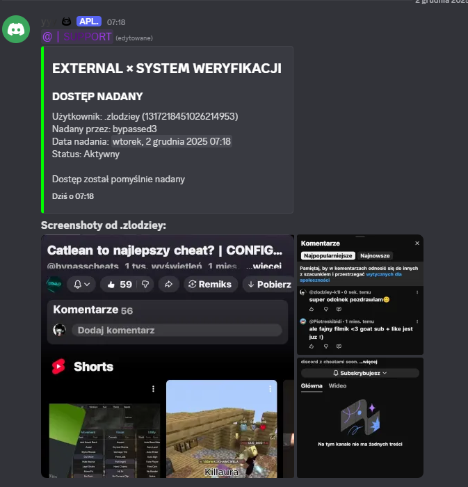
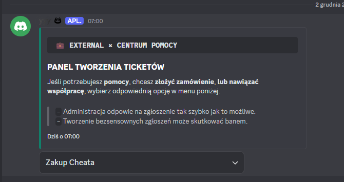
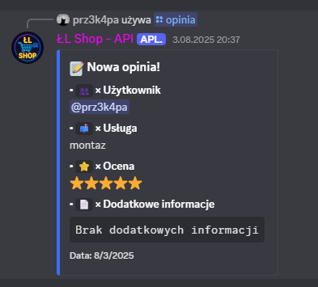
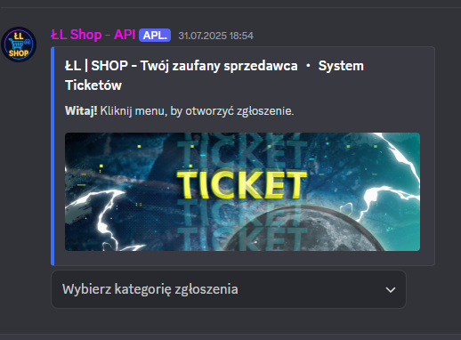
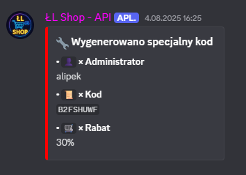

# Portfolio
Jestem developerem Java i JavaScript. Tworzę boty Discord oraz pluginy do Minecrafta, stawiając na prostotę, dobrą wydajność i czysty, czytelny kod.

## ⚙️ Technologie

### 🟧 Java
- Pluginy Minecraft (Spigot / Paper)
- Tworzenie mechanik, logiki gry i narzędzi administracyjnych

### 🟨 JavaScript
- Boty Discord (discord.js)
- Rozbudowane systemy komend, automatyzacje, integracje z API

## 🚀 Wybrane projekty
- **Bot Discord dla HydraLeaks (7k użytkowników)**
  Moderacja, automatyzacje i niestandardowe funkcje dla społeczności
- **Pluginy Minecraft dla serwera MnCraft.PL (2k na Discordzie [80 - 100 graczy w Minecraftcie])**
  Mechaniki serwerowe, narzędzia administracyjne, stabilna infrastruktura
- **Projekty własne**
  Boty, pluginy oraz różne narzędzia w Java i JavaScript

## 📫 Kontakt
- Discord: external.com

## Bot dla serwera - HydraLeaks (ok. 7k użytkowników)

        

## Bot dla serwera - Bypass Cheats & Configs (ok. 700 użytkowników)
   

## Bot dla serwera - ŁL Shop (ok. 80 użytkowników)
   
